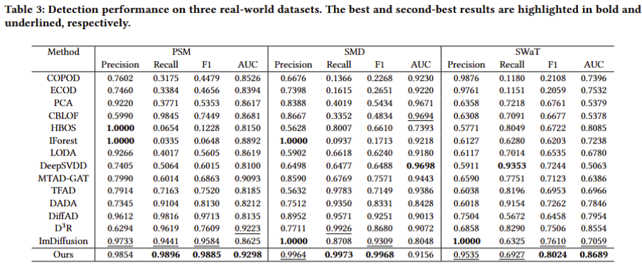

# DG-DSD
DG-DSD: Decomposition-Guided Dual-Scale Diffusion Model for Multivariate Time Series Anomaly Detection
---

## Results

The main experimental results are summarized in the following table.  
Our method achieves superior performance on the majority of evaluation metrics across multiple benchmark datasets.



---

## Data

We evaluate ADMDiff on the following datasets:

- **PSM**
- **SMD**
- **SWaT**

### Dataset Preparation

Two benchmark datasets can be downloaded from [Google Cloud](https://drive.google.com/drive/folders/1UJ6SGfb6h-9R0L18FLDXpISKh1nhaqWA), where the data have been well pre-processed.  

---

## Environment Setup

We recommend using Conda to create an isolated environment.

```bash
conda create -n dgdsd python=3.10.17
conda activate dgdsd 
pip install -r requirements.txt
```
Before training the diffusion model, the decomposition module should be trained first. For example, using the SMD dataset:

```shell
python decomposer.py --dataset SMD --device 0
```

After the decomposition model is trained, run the following command :

```shell
python train.py --device cuda:0 --dataset SMD
```
After completing training, perform inference using:
```shell
python evaluate.py --device cuda:0 --dataset SMD
```
After inference, anomaly scores can be computed using:
```shell
python evaluation.py --dataset_name SMD
```
The final results will be saved in the corresponding result directory.

